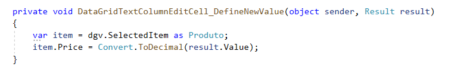

# CellEdit: Editar célula em outra Window

• Permite editar célula abrindo outra window assim que iniciar a digitação. Com a biblioteca é possível aplicar validações personalizadas por coluna, definir e aplicar lógica ao 
setar o novo dado confirmado pelo usuário, ter o textbox de edição formatado para cada tipo de dado (decimal, date, string, inteiro ...)

• Para tornar o DataGrid editável basta definir **IsReadOnly="False"**. Para bloquear as colunas que não podem ser editáveis, é só definir uma a uma como **IsReadOnly="True"**

No construtor da Window, execute, por exemplo: **new DataGridCellEdit<Produto>().BeginEdit(datagrid);**

	

## Validação personalizada
Para validar o dado antes de sobrescrever o dado antigo, basta usar a **DataGridTextColumnEditCell** e usar o evento **Validation**. Dessa forma é possível adiciona a lógica da 
validação para cada uma das colunas(campo).

### Exemplo:
Mudar o Id 4 para 1

	

## Definir novo Dado na propriedade da classe
Por padrão, ao concluir edição com "Enter", a biblioteca já se encarrega de fazer a mudança na propriedade da classe. Mas, se por algum motivo seja necessário aplicar alguma 
lógica ao confirmar o novo dado, por exemplo: recalcular valores com base no novo dado... Nesse caso é só usar a **DataGridTextColumnEditCell** e usar o evento **DefineNewValue**.
Usando o evento, a biblioteca deixa de fazer o processo automático e delega para o método anexado ao evento.

### Exemplo:
Na coluna do exemplo, foi usado o **DefineNewValue** para que fosse executado ao ser confirmado pelo usuário o novo dado. No exemplo é capturado o obj em dgv.SelectedItem e 
definido o result.Value em item.Price

	

# Testes
>> Iniciar edição
 - Digitando algo
	Decimal, Int, Mask ou Date:
		- Tentar digitar letras => Não deve iniciar a digitação
		- Tentar digitar números => Deve iniciar a digitação
	String
		- Tentar digitar letras => Deve deve iniciar a digitação
		- Tentar digitar números => Deve iniciar a digitação

 - F2 (nativo)
	Deve abrir o campo para edição

 - Clique duplo
	Deve abrir o campo para edição

>>Confirmar mudança
 - Iniciar mudança
	Clicar em outro lugar => Deve confirmar o novo dado
	Pressionar Enter => Deve confirmar o novo dado

	Data: 
		-informar uma data inválida
			- Clicar em outro lugar: Não deve confirmar o novo dado, mostrar erro vermelho
   
	Valor: 
		-informar uma data inválida
			- Clicar em outro lugar: Não deve confirmar o novo dado, mostrar erro vermelho
