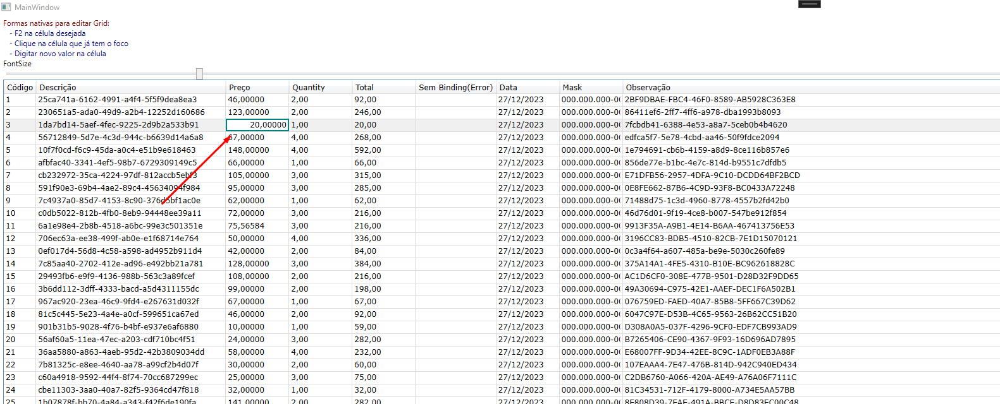

# CellEdit: Editar célula em outra Window

• Permite editar célula abrindo outra window assim que iniciar a digitação do dado. Com a biblioteca é possível aplicar validações específicas por coluna, definir e aplicar lógica ao 
setar o novo dado confirmado pelo usuário, ter o textbox de edição formatado para cada tipo de dado (decimal, date, string, inteiro ...)

• Para tornar o DataGrid editável basta definir **IsReadOnly="False"**. Para bloquear as colunas que não podem ser editáveis, é só definir uma a uma como **IsReadOnly="True"**

	

## Validação personalizada
Para valida o dado antes de sobrescrever o dado antigo, basta usar a **DataGridTextColumnEditCell** e usar o evento **Validation**. Dessa forma é possível adiciona a lógica da 
validação para cada uma das colunas(campo). Caso não seja necessário, é só usar o **DataGridTextColumn** padrão

### Exemplo:
Mudar o Id 4 para 1

	

## Definir na propriedade da classe o novo dado
Por padrão, ao concluir edição com "Enter", a biblioteca já se encarrega de fazer a mudança na propriedade da classe. Mas, se por algum motivo seja necessário aplicar alguma 
lógica ao confirmar o novo dado, por exemplo: recalcular valores com base no novo dado... Nesse caso é só usar a **DataGridTextColumnEditCell** e usar o evento **DefineNewValue**.
Usando o evento, a biblioteca deixa de fazer o processo automático e delega para o método anexado ao evento.
